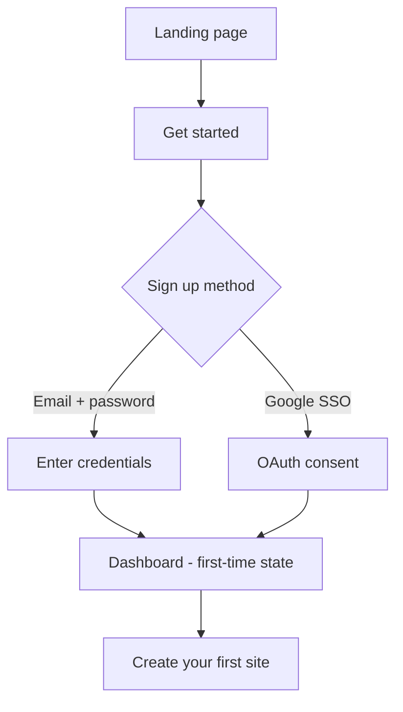
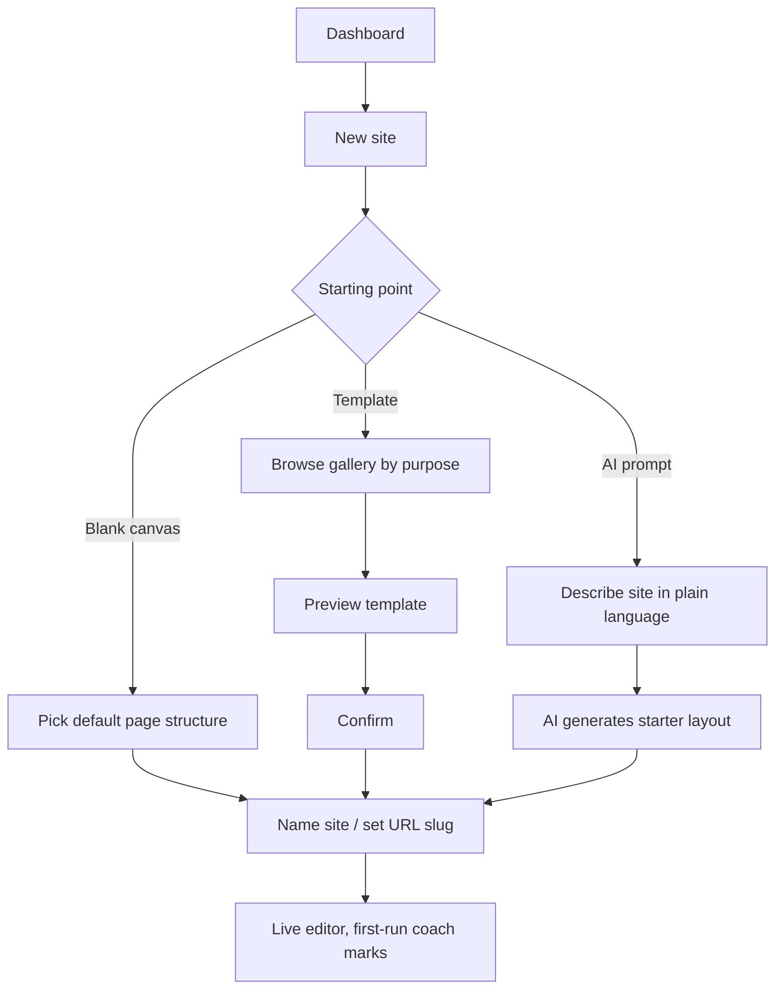
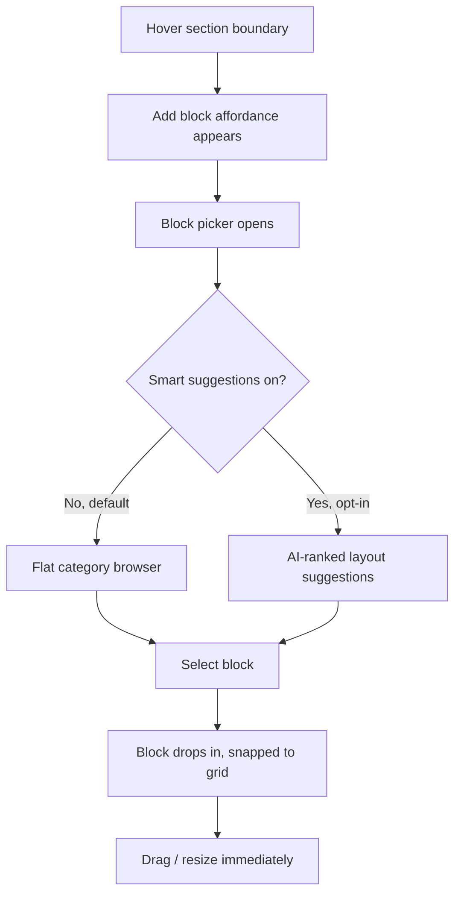
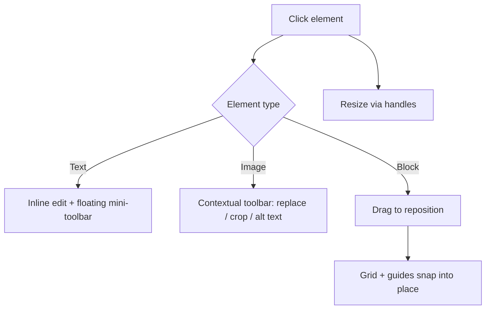
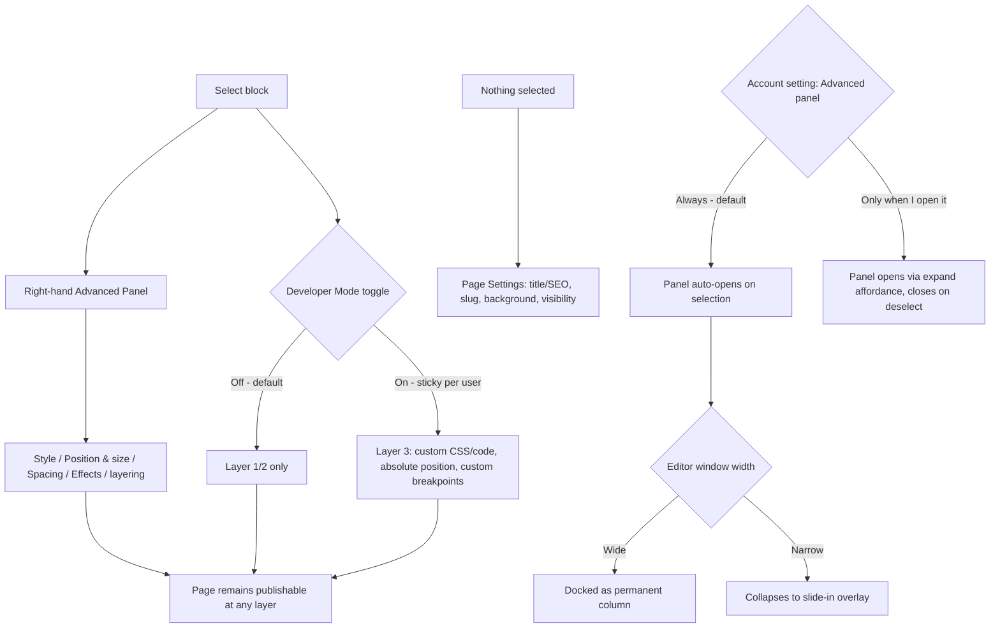
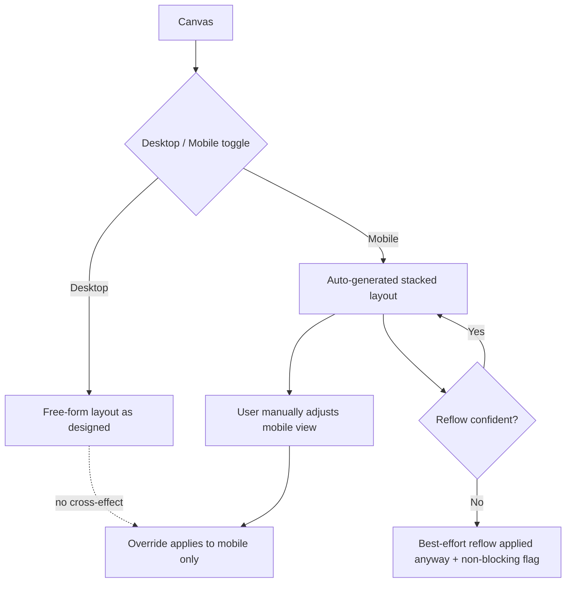
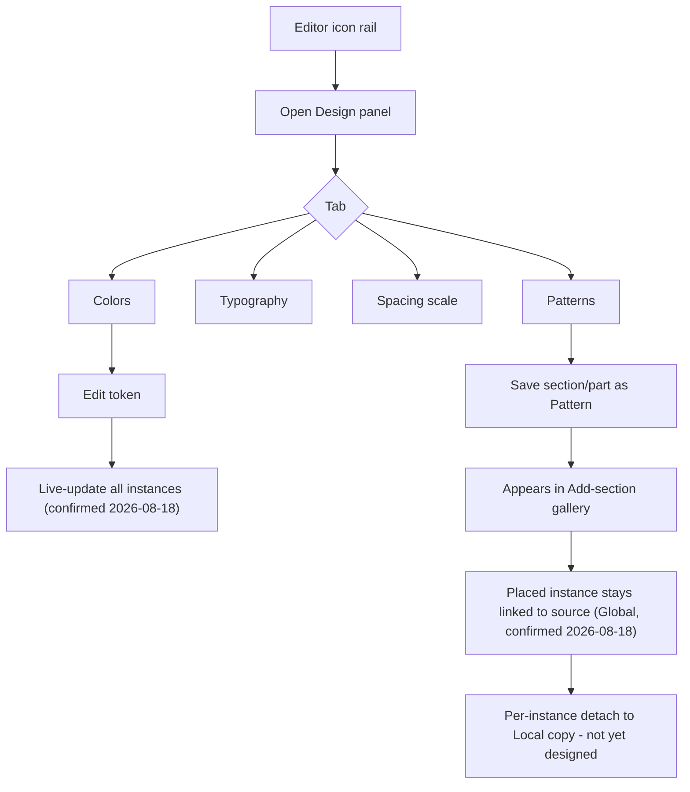
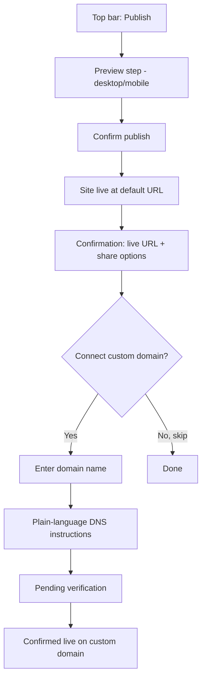
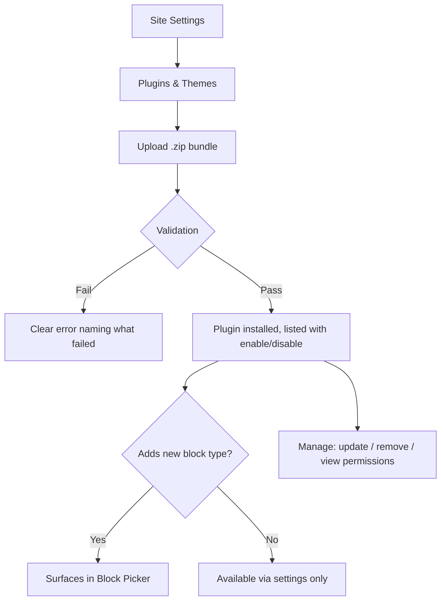

# User Flows v1 — End-to-End

Covers the full product surface, from signup through publishing, plus a deeper drill-down on the editor flows already sketched in `website-builder-ux-spec.md` §3. Two flows here (Plugin/Theme upload, Publish/Domain) fill gaps flagged as "not yet covered" in `wireframes-notes.md`.

Each flow has: a short rationale, numbered steps, decision points called out explicitly, and a Mermaid diagram (renders in any Mermaid-aware viewer; also provided as a rendered HTML file).

---

## 1. Account Creation & Onboarding

**Why this shape:** Get a new user to a working site in the fewest possible decisions — WordPress's biggest early friction is the admin/settings maze before you ever see a page.

1. Landing page → "Get started"
2. Enter email + password, or continue with Google (SSO)
3. Land on Dashboard — first-time state shows a single prominent "Create your first site" card, not an empty grid
4. → proceeds into **Flow 2: New Site Creation**

Decision point: email verification can happen async (don't block the create-a-site flow on it) — flagging as a recommendation, not yet confirmed.

---

## 2. New Site Creation (Dashboard → Editor)

**Why this shape:** Mirrors the UX spec's "onboarding → first page" principle (§3.1) — no dashboard detour once a starting point is picked, land straight in the live editor.

1. Dashboard → "New site"
2. Choose a starting point:
   - **Blank canvas** — pick a default page structure (e.g. header + hero + footer), land in editor
   - **Template** — browse gallery grouped by purpose (Portfolio, Business, Blog, Store) → preview → confirm
   - **Build from a prompt** (AI-assisted) — describe the site in plain language → AI generates a starter layout → land in editor with generated content, editable immediately
3. Name the site / set URL slug
4. Land directly in the live editor with first-run coach marks (click text to edit, drag to move)

Open question carried over from the UX spec (§7.1): should the block picker's "smart suggestions" extend to this starting-point step too, or stay scoped to in-editor section adding? Tracked as `open-decisions.md` #4.

---

## 3. Editor — Adding Content

Expands UX spec §3.2.

1. Hover an empty area or the boundary between sections → "Add block" affordance appears
2. Click it → block picker opens: visual thumbnails grouped by purpose (Text, Image, Gallery, Form, Button, Embed), searchable
3. Optional: toggle "Smart suggestions" (off by default — live model call, see backlog) for AI-ranked layouts instead of the flat category browser
4. Select a block → drops in at a sensible default size/position, snapped to grid
5. Block is immediately draggable/resizable — no extra confirmation step

---

## 4. Editor — Editing an Element (Layer 1, Direct Controller)

Expands UX spec §3.3. This is the flow that carries the most weight for the "easier than WordPress" positioning — it should need zero panels for the common case. The direct controller intentionally stays small and fixed; it does not grow to absorb every new capability (see Flow 5, updated 2026-08-17).

1. Click text → inline edit, cursor appears, floating mini-toolbar (font, size, color, weight) appears adjacent
2. Click image → contextual toolbar: replace / crop / alt text
3. Drag a block → grid + alignment guides snap it into place; siblings reflow only inside a "stacked" section, otherwise free position is preserved
4. Resize via corner/edge handles — same gesture as resizing an image in a slides tool

---

## 5. Editor — The Advanced Panel (Layer 2) and Developer Mode (Layer 3)

Expands UX spec §3.4 — **revised 2026-08-17.** The previous version of this flow had a "..." affordance popping open an ad hoc expando next to the direct controller; that pattern was getting overloaded as more properties (animation, button styles, etc.) got added to it. It's replaced with one well-structured panel docked to the right of the canvas, and a new account-level preference for how eagerly that panel appears. Progressive disclosure is still the core differentiator vs. Framer — neither layer below is ever required to ship a page.

1. Selecting a block surfaces its full set of advanced properties in the right-hand panel, grouped into clear sections: Style, Position & size (opacity, rotation, precise x/y/width/height), Spacing, Effects, layering (bring to front/send to back), plus any block-specific extras.
2. **Default:** the panel opens automatically on selection. When nothing is selected, it falls back to **Page Settings** (page title & SEO, URL slug, page background, visibility/password protection, plus page-level custom code if Developer Mode is on) rather than going blank — resolved 2026-08-17.
3. **Account Settings (outside the builder) — "Advanced panel" preference**, per user, follows them across every site they edit:
   - **Always** (default) — auto-opens on selection, as above.
   - **Only when I open it** — panel stays closed until the user clicks a small expand affordance on the direct controller; closes again on deselect. This is the old invoke-only behavior, now opt-in rather than the default.
4. **Separately**, the existing "Developer Mode" toggle (off by default, sticky once enabled) unlocks Layer 3: custom CSS/code blocks, true absolute positioning outside the grid, custom breakpoints. This toggle is independent of the Advanced panel preference above — one controls *what's available*, the other controls *when the panel shows up*.
5. **Responsive presentation** (resolved 2026-08-17): docked-vs-overlay is driven by available width in the builder's own window, independent of the Always/Only-when-invoked preference. Wide window → panel stays docked as a permanent column. Narrow window → panel collapses to an overlay that slides in over the canvas on selection and closes on deselect, even under "Always."
6. User exits either layer at any time with a completed, valid page — nothing here gates publishing.

---

## 6. Editor — Responsive Editing

Expands UX spec §3.5.

1. Desktop/Mobile toggle pinned to top of canvas
2. Switching to Mobile shows an auto-generated stacked layout, carried over from desktop content/structure
3. Manual repositioning in Mobile overrides auto-layout for that breakpoint only — desktop is never affected, and vice versa

**Resolved 2026-08-18** (was an open question carried from the UX spec §7.4): when a free-form desktop layout breaks badly on mobile auto-generation, the builder applies a silent best-effort reflow automatically — nothing here blocks publishing — and shows a small, non-blocking indicator (e.g. "3 elements may need a look on mobile") so the user knows to check, without being forced to stop and fix it first. This keeps the same non-blocking bias already used elsewhere in the product (no modal tutorial wall at onboarding, a lightweight publish preview rather than a hard gate). Full reasoning in `website-builder-ux-spec.md` §3.5.4.

---

## 7. Design System Flow

Drafted from the "Key Screens" and wireframes notes. The open questions originally logged here were resolved 2026-08-18.

1. From the editor's icon rail, open the global Design panel
2. Tabs: Colors, Typography, Spacing scale, Patterns
3. Edit a token (e.g. a color) — **confirmed 2026-08-18:** the change live-updates every instance using that token across the canvas immediately. No separate "publish tokens" step — this matches how every other edit in the product works (direct manipulation, no modes), so a token edit isn't the one place in the product that behaves differently.
4. Save a section as a Pattern from the canvas → it becomes available inside the Add-section gallery under "Patterns"
5. Return to canvas, continue editing. **Confirmed 2026-08-18:** a placed Pattern/Part instance stays linked to its source by default (Global) — editing the source (e.g. the saved "Info card" Part) updates every instance already placed on any page, similar to how a Figma component works. Follow-up, not yet designed: a per-instance "detach" (Local copy) affordance should exist for the one-off-exception case, consistent with the pattern already used for button-style overrides (edited once site-wide in the Design panel, with per-button overrides still available in that button's own Layer 2 properties). Worth a wireframe pass before this ships, but it doesn't block the Global-by-default decision itself.

**Scoping (confirmed 2026-08-18):** design tokens are scoped per-site only for MVP — there is no team-shared token library across a team's multiple sites yet. Simpler data model, and matches the MVP's single-user/small-team scope rather than building agency-library infrastructure ahead of the team/permissions model. A shared library for agency use is logged as a deferred feature in `post-mvp-backlog.md` (Design System section), to revisit once that model exists.

---

## 8. Publish & Domain Flow

Not yet in the UX spec as a numbered flow — flagged as "not yet covered" in wireframes notes. Drafted from UX spec §3.6 (Publish, 2 steps) expanded to include domain connection, which wasn't covered anywhere yet.

1. Persistent "Publish" button, always visible in the top bar
2. Click → lightweight preview step (desktop/mobile toggle available) before committing
3. Confirm publish → site goes live at a default URL
4. Post-publish confirmation: live URL, "Copy link" / share options — plain language, no deployment jargon
5. Optional: "Connect a custom domain" → enter domain name → plain-language DNS instructions → pending-verification state → confirmed-live state

Open question: what happens to in-progress edits if a user publishes mid-edit on another device/tab — do we need a conflict/lock state? Now logged as a concrete backlog item in `post-mvp-backlog.md` (Collaboration & Permissions section), with a note that this can happen even for a single user with two tabs open.

---

## 9. Plugin / Theme Upload & Management

Not yet covered anywhere — drafted fresh from "The idea" doc's requirement: plugins/themes via uploaded HTML/CSS/JS files, not PHP.

1. From Dashboard or Site Settings → "Plugins & Themes"
2. "Upload" → file picker accepts a `.zip` bundle (HTML/CSS/JS + manifest)
3. System validates the bundle (manifest check, safe-code scan) → success or clear error state naming what failed
4. Installed plugin appears in a list with an enable/disable toggle
5. If the plugin adds a new block type, it surfaces in the Block Picker under the relevant category automatically
6. Management actions per plugin: update (re-upload new version), remove, view what it modifies/touches on the site

**Security model — resolved 2026-08-17:** treated as two different risk surfaces, not one blanket policy.

- **Code running on the published site** (visitor-facing widgets, embeds, animations) — immediate on upload, no manual review gate. This mirrors Squarespace/Webflow's custom-code embeds: it's the site owner's own choice, affecting only their own site, and a review queue would recreate the exact WordPress-style friction this product is designed away from. Automated hygiene still applies at upload: manifest schema validation, a static scan flagging obvious red flags (`eval`, obfuscated code, remote script injection, requests to unknown domains), and a default Content-Security-Policy on the published site so a compromised plugin can't silently exfiltrate data.
- **Code running inside the authenticated editor/dashboard** (a settings panel, a builder-UI hook, anything needing API access) — sandboxed unconditionally, no MVP exception. This is the dangerous surface: an authenticated context with session cookies and account-level API access, which is exactly where WordPress plugins do real damage. Plugin UI runs in an iframe with no direct DOM access to the parent, communicating only through a restricted postMessage API, and declares upfront what it's asking for (e.g. "reads page content," "adds a block type," "no network access requested") — shown to the user before they enable it, similar to a browser extension's permission manifest. This is a build-time architecture decision, worth locking down now rather than retrofitting.

**Still open:** if a public marketplace (User A installs a plugin User B authored) is ever on the roadmap, that's a different trust model and would need a manual review/approval gate before public listing, plus versioning and code signing — similar to browser extension stores. Not needed for MVP's single-user/small-team scope, but worth deciding whether it's on the roadmap since it changes how much the sandboxing architecture should anticipate now. Tracked as `open-decisions.md` #12.

---

## Summary — Flow Inventory

| # | Flow | Status |
|---|---|---|
| 1 | Account creation & onboarding | New — not previously drafted |
| 2 | New site creation | New — not previously drafted |
| 3 | Adding content | Expanded from UX spec §3.2 |
| 4 | Editing an element (Layer 1, Direct Controller) | Expanded from UX spec §3.3 |
| 5 | Advanced Panel (Layer 2) and Developer Mode (Layer 3) | Expanded from UX spec §3.4 — revised 2026-08-17 |
| 6 | Responsive editing | Expanded from UX spec §3.5 — mobile fallback UX resolved 2026-08-18 |
| 7 | Design system | New — drafted from Key Screens + wireframes notes; open questions (token live-update, token scoping, Pattern linking) resolved 2026-08-18 |
| 8 | Publish & domain | Expanded from UX spec §3.6 + domain connection (new) |
| 9 | Plugin/theme upload & management | New — fills gap flagged in wireframes notes |

Flows not included here on purpose: team/multi-user collaboration and per-site role permissions — both explicitly deferred in `post-mvp-backlog.md` since the MVP targets single-user/small-team use. See `claude/open-decisions.md` #10 for the open question on what exactly "small-team use" includes at MVP.
